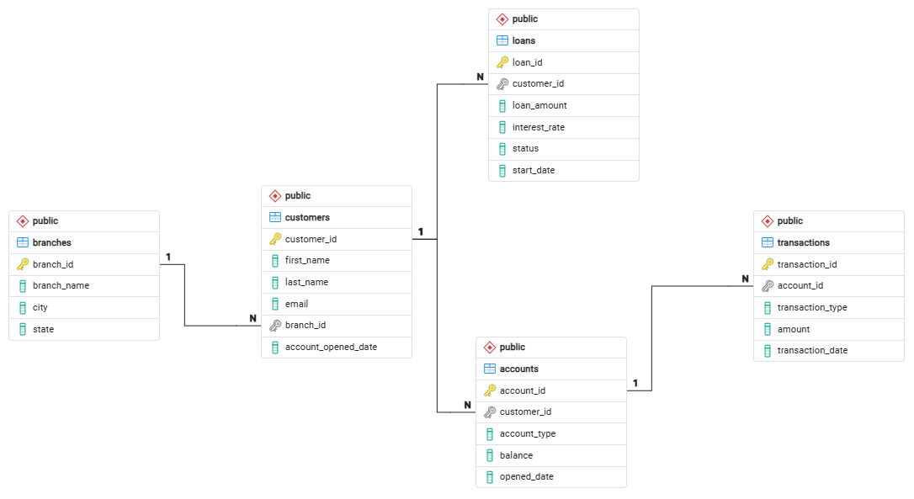

<<<<<<< HEAD
# MIS443_GroupD2NB_Banking  

**A PostgreSQL implementation of a commercial banking database, built for MIS 443 - Business Data Management.**


## Course & Assignment
**Course:** MIS 443 - Business Data Management  
**Assignment:** Assignment 2 - PostgreSQL Database Development and SQL Practice  
**Lecturer:** Mr. Dang Thai Doan  
**Quarter:** Quarter 4, Academic Year 2025-2026  

## Group Information
**Group Name:** D2NB

| No. | Student's Name | Student's IRN | GitHub Repository |
|---|---|---|---|
| 1 | Vũ Đông Dương | 2032300044 | [View on GitHub](https://github.com/DuongvuBBS20/MIS443-Q4-2025_2026/tree/main/MIS443_GroupD2NB_Banking) |
| 2 | Thân Quế Ngọc | 2232300060 | [View on GitHub](https://github.com/thanquengoc/MIS_443/tree/main/MIS443_GroupD2NB_Banking) |
| 3 | Văn Vũ Quỳnh Như | 2232300079 | [View on GitHub](https://github.com/vvqnhu204/MIS443-Q4-2025_2026/tree/main/MIS443_GroupD2NB_Banking) |
| 4 | Đỗ Hoàng Bảo | 2232300071 | [View on GitHub](https://github.com/dohoangbao2004-maker/MIS-443/tree/main/MIS443_GroupD2NB_Banking) |


## Selected Schema
**Banking** - a relational database simulating a commercial banking management system, consisting of five related tables: `branches`, `customers`, `accounts`, `loans`, and `transactions`.

## Entity-Relationship Diagram



## Project Description
This project recreates the Banking schema from SQL Practice Online in PostgreSQL using pgAdmin 4. The group designed and implemented five relational tables with appropriate primary keys, foreign keys, and constraints, populated them with CSV data, and completed all 30 SQL practice questions covering filtering, sorting, joins, aggregation, subqueries, window functions, and Common Table Expressions (CTEs).

## At a Glance
| Metric | Value |
|---|---|
| Total Tables | 5 |
| SQL Questions Solved | 30 |
| Branches (Records) | 5 |
| Customers (Records) | 7 |
| Accounts (Records) | 8 |
| Transactions (Records) | 8 |
| Loans (Records) | 4 |
| SQL Concepts Applied | JOINs, Subqueries, Window Functions, CTEs |

## Tools Used
- **PostgreSQL** - database management system
- **pgAdmin 4** - database creation and query execution
- **SQL Practice Online** - source schema and question set
- **Microsoft Word** - group report
- **CSV files** - data storage for each table
- **GitHub** - project publishing and version control

## Folder Structure
```
MIS443_GroupD2NB_Banking/
│
├── codes/
│   ├── 01_create_database.sql
│   ├── 02_create_tables_relationships.sql
│   ├── 03_insert_data.sql
│   └── 04_questions_01_30.sql
│
├── data/
│   ├── branches.csv
│   ├── customers.csv
│   ├── accounts.csv
│   ├── transactions.csv
│   └── loans.csv
│
├── report/
│   ├── MIS443_GroupD2NB_Banking_Report.docx
│   └── erd.png
│
└── README.md
```
 
## Instructions for Running the SQL Scripts (How to Run)  
**Step 1 - Set up the database**  
Open pgAdmin 4, connect to your PostgreSQL server, and run `codes/01_create_database.sql` from the default `postgres` connection. This creates the `banking` database used throughout the project.

**Step 2 - Build the schema**  
Switch your connection to the newly created `banking` database, then execute `codes/02_create_tables_relationships.sql`. This script defines all five tables along with their primary keys, foreign keys, and constraints.

**Step 3 - Load the data**  
Run `codes/03_insert_data.sql` to populate every table with the project's sample records. The raw values used here are the same ones found in the `data/` folder, provided separately as CSV files for reference or re-import.

**Step 4 - Run the practice queries**  
Finally, execute `codes/04_questions_01_30.sql` to run through all 30 SQL practice questions in sequence and inspect their output in the Query Tool.

> Note: Code formatting may vary slightly between questions in `codes/04_questions_01_30.sql`, as each question was written by the team member responsible for it.

> Scripts must be run strictly in this order (01 → 02 → 03 → 04), since each step depends on objects created in the previous one.

> Ensure the CSV files in `data/` remain in the same relative folder when running the import script, as file paths are referenced from `data/`.

## Source
[SQL Practice Online – Banking Schema](https://www.sql-practice.online/practice/banking?engine=postgresql)

## Acknowledgement
This project was completed collaboratively as a group assignment for MIS 443. All members contributed to database design, SQL query development, testing, and documentation. Individual contributions are detailed in the Word report (Section 8: Responsibilities and contributions of each member).
=======
# MIS443 - Assignment 2: PostgreSQL Database Development and SQL Practice

**Course:** MIS 443 - Business Data Management 
**Lecturer:** Mr. Dang Thai Doan 
**Selected Schema:** Banking 
**Group:** D2NB

## Project Description

This project recreates the **Banking** schema from [SQL Practice Online](https://www.sql-practice.online/practice/banking?engine=postgresql) in PostgreSQL. The database models a simplified bank consisting of five related tables (`branches`, `customers`, `accounts`, `transactions`, `loans`) and includes complete solutions for all 30 SQL practice questions provided for this schema.

## Team Members & Contributions

This project was developed collaboratively. Below are the members of Group D2NB and our respective focus areas:

## Team Members & Contributions

This project was developed collaboratively. Below are the members of Group D2NB and our respective focus areas:

| No. | Student Name | Student ID | Task |
| --- | --- | --- | --- | 
| 1 | Vu Dong Duong | 2032300044 | Tested and captured screenshots for SQL Qs 3, 7, 11, 15, 19, 23, 27. Part 1 (Introduction to the selected database) and Part 2 (Table description) | 
| 2 | Than Que Ngoc | 2232300060 | Tested and captured screenshots for SQL Qs 4, 8, 12, 16, 20, 24, 28. Assigned project tasks to all members. Aggregated, checked and edited the report. Part 3 (ERD Diagram) and Part 8 (Responsibility) | 
| 3 | Van Vu Quynh Nhu | 2232300079 | Tested and captured screenshots for SQL Qs 2, 6, 10, 14, 18, 22, 26, 30. Part 5 (Summary table of SQL questions) and Part 7 (Challenges) | 
| 4 | Do Hoang Bao | 2232300071 | Tested and captured screenshots for SQL Qs 1, 5, 9, 13, 17, 21, 25, 29. Part 4 (Summary of database implementation) and Part 9 (Conclusion) |


## Tools Used

* **PostgreSQL:** Core database engine.
* **pgAdmin 4:** Database creation, management, and query execution.
* **SQL Practice Online:** Source schema and question set.
* **Microsoft Word:** Group report documentation.
* **CSV:** Data storage and import format.
* **GitHub:** Version control and project publication.

## Folder Structure

```text
MIS443_GroupD2NB_Banking/
│
├── codes/
│   ├── 01_create_database.sql
│   ├── 02_create_tables_relationships.sql
│   ├── 03_insert_data.sql
│   └── 04_questions_01_30.sql
│
├── data/
│   ├── branches.csv
│   ├── customers.csv
│   ├── accounts.csv
│   ├── transactions.csv
│   └── loans.csv
│
├── report/
│   └── MIS443_GroupD2NB_Banking_Report.docx
│
└── README.md
```


## How to Run

1. Open **pgAdmin 4** and connect to your local PostgreSQL server.
2. Open the Query Tool on the default `postgres` database and run `codes/01_create_database.sql` to create the banking database.
3. Reconnect the Query Tool to the newly created `banking` database.
4. Run `codes/02_create_tables_relationships.sql` to create all tables, primary/foreign keys, and constraints.
5. Run `codes/03_insert_data.sql` to populate the tables (the raw data is also available as CSV files in the `data/` folder).
6. Run `codes/04_questions_01_30.sql` to execute all 30 SQL practice questions and review the output results.

## Source

* Schema and question set provided by: [SQL Practice Online - Banking](https://www.sql-practice.online/practice/banking?engine=postgresql)

## Acknowledgement

This repository showcases the database implementation and SQL problem-solving completed collaboratively by Group D2NB for the MIS 443 course. All members contributed significantly to the successful delivery of the final report and database structure.

>>>>>>> ef869a818849eb5cb83c129a07ca61e357e83ea6
